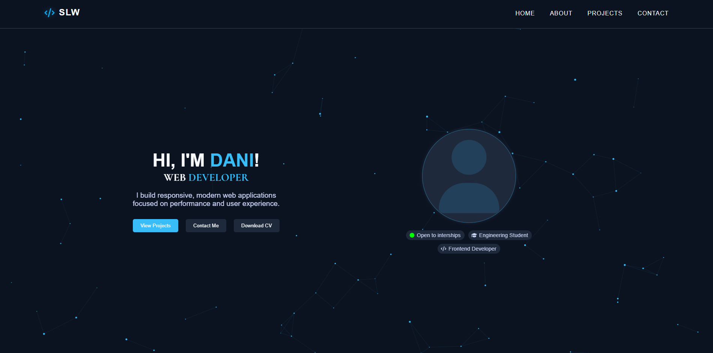

<h1 align="center">💼 Personal Portfolio</h1>

  
  
  
   
  

Made on 🟢 May 14, 2026

---

## 🖼 Project Preview

  

🔗 Live Demo: https://danislw.github.io/Personal-Portfolio/

*The portfolio is hosted using GitHub Pages.*

---

## 🧠 Project Details

**Personal Portfolio** is a modern and responsive web portfolio designed to showcase my projects, tehnical skills, and experience as a developer.

The website focuses on clean UI design, smooth animations, responsive layouts, and an interactive user experience.
Everything was built from scratch using **vanilla HTML, CSS, JavaScript and JSON**, without external frameworks.

The goal of this project is to create a profesional online presence and present my work in a visually appealing and organized way.

---

## ✨ Features

- 🎨 Modern dark-themed UI
- 📱 Fully responsive design
- ⚡ Smooth animations and transitions
- 🧩 Interactive project carousel
- 🛠️ Skills section with clean layout
- 📚 Education & experience timeline
- 🌐 Optimized for desktop and mobile devices
- 🚀 Fast and lightweight

---

## 🛠️ Technologies Used

This project was developed using:

- 🧱 **HTML5** - Website structure
- 🎨 **CSS3** - Styling, animations and responsive design
- ⚡ **JavaScript (ES6)** - Interactivity and dynamic components
- 📄 **JSON** - Takeing data about projects

👉 No external frameworks or libraries were used.

---

## 👨‍💻 Author

Created and maintined by
**Datcu Daniel-Alexandru**
